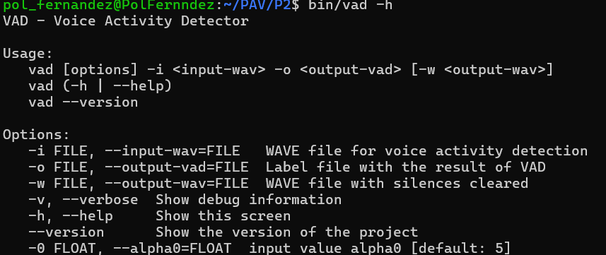

PAV - P2: detección de actividad vocal (VAD)
============================================

Pol Fernández Martínez y Izan Marín Sánchez

Esta práctica se distribuye a través del repositorio GitHub [Práctica 2](https://github.com/albino-pav/P2),
y una parte de su gestión se realizará mediante esta web de trabajo colaborativo.  Al contrario que Git,
GitHub se gestiona completamente desde un entorno gráfico bastante intuitivo. Además, está razonablemente
documentado, tanto internamente, mediante sus [Guías de GitHub](https://guides.github.com/), como
externamente, mediante infinidad de tutoriales, guías y vídeos disponibles gratuitamente en internet.


Inicialización del repositorio de la práctica.
----------------------------------------------

Para cargar los ficheros en su ordenador personal debe seguir los pasos siguientes:

*	Abra una cuenta GitHub para gestionar esta y el resto de prácticas del curso.
*	Cree un repositorio GitHub con el contenido inicial de la práctica (sólo debe hacerlo uno de los
	integrantes del grupo de laboratorio, cuya página GitHub actuará de repositorio central del grupo):
	-	Acceda la página de la [Práctica 2](https://github.com/albino-pav/P2).
	-	En la parte superior derecha encontrará el botón **`Fork`**. Apriételo y, después de unos segundos,
		se creará en su cuenta GitHub un proyecto con el mismo nombre (**P2**). Si ya tuviera uno con ese 
		nombre, se utilizará el nombre **P2-1**, y así sucesivamente.
*	Habilite al resto de miembros del grupo como *colaboradores* del proyecto; de este modo, podrán
	subir sus modificaciones al repositorio central:
	-	En la página principal del repositorio, en la pestaña **:gear:`Settings`**, escoja la opción 
		**Collaborators** y añada a su compañero de prácticas.
	-	Éste recibirá un email solicitándole confirmación. Una vez confirmado, tanto él como el
		propietario podrán gestionar el repositorio, por ejemplo: crear ramas en él o subir las
		modificaciones de su directorio local de trabajo al repositorio GitHub.
*	En la página principal del repositorio, localice el botón **Branch: master** y úselo para crear
	una rama nueva con los primeros apellidos de los integrantes del equipo de prácticas separados por
	guion (**fulano-mengano**).
*	Todos los miembros del grupo deben realizar su copia local en su ordenador personal.
	-	Copie la dirección de su copia del repositorio apretando en el botón **Clone or download**.
		Asegúrese de usar *Clone with HTTPS*.
	-	Abra una sesión de Bash en su ordenador personal y vaya al directorio **PAV**. Desde ahí, ejecute:

		```.sh
		git clone dirección-del-fork-de-la-práctica
		```

	-	Vaya al directorio de la práctica `cd P2`.

	-	Cambie a la rama **fulano-mengano** con la orden:

		```.sh
		git checkout fulano-mengano
		```

*	A partir de este momento, todos los miembros del grupo de prácticas pueden trabajar en su directorio
	local del modo habitual, usando el repositorio remoto en GitHub como repositorio central para el trabajo colaborativo
	de los distintos miembros del grupo de prácticas o como copia de seguridad.
	-	Puede *confirmar* versiones del proyecto en su directorio local con las órdenes siguientes:

		```.sh
		git add .
		git commit -m "Mensaje del commit"
		```

	-	Las versiones confirmadas, y sólo ellas, se almacenan en el repositorio y pueden ser accedidas en cualquier momento.

*	Para interactuar con el contenido remoto en GitHub es necesario que los cambios en el directorio local estén confirmados.

	-	Puede comprobar si el directorio está *limpio* (es decir, si la versión actual está confirmada) usando el comando
		`git status`.

	-	La versión actual del directorio local se sube al repositorio remoto con la orden:

		```.sh
		git push
		```

		*	Si el repositorio remoto contiene cambios no presentes en el directorio local, `git` puede negarse
			a subir el nuevo contenido.

			-	En ese caso, lo primero que deberemos hacer es incorporar los cambios presentes en el repositorio
				GitHub con la orden `git pull`.

			-	Es posible que, al hacer el `git pull` aparezcan *conflictos*; es decir, ficheros que se han modificado
				tanto en el directorio local como en el repositorio GitHub y que `git` no sabe cómo combinar.

			-	Los conflictos aparecen marcados con cadenas del estilo `>>>>`, `<<<<` y `====`. Los ficheros correspondientes
				deben ser editados para decidir qué versión preferimos conservar. Un editor avanzado, del estilo de Microsoft
				Visual Studio Code, puede resultar muy útil para localizar los conflictos y resolverlos.

			-	Tras resolver los conflictos, se ha de confirmar los cambios con `git commit` y ya estaremos en condiciones
				de subir la nueva versión a GitHub con el comando `git push`.


	-	Para bajar al directorio local el contenido del repositorio GitHub hay que ejecutar la orden:

		```.sh
		git pull
		```
	
		*	Si el repositorio local contiene cambios no presentes en el directorio remoto, `git` puede negarse a bajar
			el contenido de este último.

			-	La resolución de los posibles conflictos se realiza como se explica más arriba para
				la subida del contenido local con el comando `git push`.


*	Al final de la práctica, la rama **fulano-mengano** del repositorio GitHub servirá para remitir la
	práctica para su evaluación utilizando el mecanismo *pull request*.
	-	Vaya a la página principal de la copia del repositorio y asegúrese de estar en la rama
		**fulano-mengano**.
	-	Pulse en el botón **New pull request**, y siga las instrucciones de GitHub.


Entrega de la práctica.
-----------------------

Responda, en este mismo documento (README.md), los ejercicios indicados a continuación. Este documento es
un fichero de texto escrito con un formato denominado _**markdown**_. La principal característica de este
formato es que, manteniendo la legibilidad cuando se visualiza con herramientas en modo texto (`more`,
`less`, editores varios, ...), permite amplias posibilidades de visualización con formato en una amplia
gama de aplicaciones; muy notablemente, **GitHub**, **Doxygen** y **Facebook** (ciertamente, :eyes:).

En GitHub. cuando existe un fichero denominado README.md en el directorio raíz de un repositorio, se
interpreta y muestra al entrar en el repositorio.

Debe redactar las respuestas a los ejercicios usando Markdown. Puede encontrar información acerca de su
sintáxis en la página web [Sintaxis de Markdown](https://daringfireball.net/projects/markdown/syntax).
También puede consultar el documento adjunto [MARKDOWN.md](MARKDOWN.md), en el que se enumeran los
elementos más relevantes para completar la redacción de esta práctica.

Recuerde realizar el *pull request* una vez completada la práctica.

Ejercicios
----------

### Etiquetado manual de los segmentos de voz y silencio

- Etiquete manualmente los segmentos de voz y silencio del fichero grabado al efecto. Inserte, a 
  continuación, una captura de `wavesurfer` en la que se vea con claridad la señal temporal, el contorno de
  potencia y la tasa de cruces por cero, junto con el etiquetado manual de los segmentos.


TABLA CON NUESTRO ETIQUETADO MANUAL

| Tiempo inicial | Tiempo final | Actividad vocal |
|----------------|--------------|-----------------|
| 0.0000         | 0.4700       | S               |
| 0.4775         | 1.6600       | V               |
| 1.6600         | 1.9025       | S               |
| 1.9025         | 2.9250       | V               |
| 2.9250         | 3.8000       | S               |
| 3.8000         | 5.1425       | V               |
| 5.1425         | 5.9075       | S               |
| 5.9075         | 7.6325       | V               |
| 7.6325         | 7.9675       | S               |


- A la vista de la gráfica, indique qué valores considera adecuados para las magnitudes siguientes:

	* Incremento del nivel potencia en dB, respecto al nivel correspondiente al silencio inicial, para
	  estar seguros de que un segmento de señal se corresponde con voz.

    En el primer silencio tenemos una potencia media de unos 20 dB. El cambio con la voz es de unos 20 dB's por encima, es decir a 40 dB's aprox, llegando a estar hasta 65 dB's.

	* Duración mínima razonable de los segmentos de voz y silencio.
    
	En nuestro audio de ejemplo, hemos considerado como silencio a partir de los 300ms. En cambio, la voz la hemos considerado a partir de 1s de duración.


	* ¿Es capaz de sacar alguna conclusión a partir de la evolución de la tasa de cruces por cero?

      La ZCR nos indica cuando el señal de un sonido varia mucho de positivo a negativo. Un claro ejemplo, es en el ruido que hay en los silencios o a los sonidos fricativos o no sonoros donde podriamos ver valores mas altos en estos tramos. Respecto nuestro audio, lo vemos claramente en la primera letra del audio, la 'S' de la palabra 'Som' como hay un pico en el gráfico de ZCR.
      

### Desarrollo del detector de actividad vocal

- Complete el código de los ficheros de la práctica para implementar un detector de actividad vocal en
  tiempo real tan exacto como sea posible. Tome como objetivo la maximización de la puntuación-F `TOTAL`.

Una vez ya modificado el código hemos conseguido una maximización del F-score.


- Inserte una gráfica en la que se vea con claridad la señal temporal, el etiquetado manual y la detección
  automática conseguida para el fichero grabado al efecto. 


La primera trascripcion (.lab) es la manual y la de debajo (.vad) es la automatica hecha por el programa.
*Comentario añadido en la última sección.

- Explique, si existen. las discrepancias entre el etiquetado manual y la detección automática.

En ambas transcripciones los principales segmentos de voz y silencio, los de más duración, coinciden con bastante semejanza. El cambio más notable, es que la detección automática también señala las pequeñas muestras de ruido que para nosotros son insignificantes y no hemos marcado. Un ejemplo de esto, es al principio de la señal, donde en la señal de audio se ve un pequeño punto de energía, que nosotros hemos obviado poniéndolo como silencio ya que en el audio no se escucha nada, pero en cambio la automática lo marca como voz.
En términos generales estamos bastante satisfechos con el resultado de la detección automática programada.

- Evalúe los resultados sobre la base de datos `db.v4` con el script `vad_evaluation.pl` e inserte a 
  continuación las tasas de sensibilidad (*recall*) y precisión para el conjunto de la base de datos (sólo
  el resumen).

Para encontrar el mejor valor que aproxima los paramatros a buscar, hacemos un bucle de la siguiente manera en el script fot-li:

for alpha0 in $(seq 4.4 0.1 5.5); do 

    echo -ne "$alpha0:\t"; 

    scripts/run_vad.sh $alpha0 | grep TOTAL;
	
done

| Valor alpha0 | TOTAL (%) |
|--------------|-----------|
| 4.4          | 89.201    |
| 4.5          | 89.222    |
| 4.6          | 89.243    |
| 4.7          | 89.265    |
| 4.8          | 89.278    |
| 4.9          | 89.291    |
| 5.0          | 89.292    |
| 5.1          | 89.305    |
| 5.2          | 89.285    |
| 5.3          | 89.276    |
| 5.4          | 89.262    |
| 5.5          | 89.246    |

De esta tabla podemos concluir que el mejor valor para alpha0 es 5.1, entonces hacemos el vad_evaluation de este valor y vemos que el summary es el siguiente: 

            Summary recall          

| Detector | Tiempo          |   %   |
|-|-|-|
| Voz      | 459.86 / 495.55 | 92.80 |
| Silencio | 262.82 / 321.17 | 81.83 |

           Summary precision        

| Detector | Tiempo          |   %   |
|-|-|-|
| Voz      | 459.86 / 518.21 | 88.74 |
| Silencio | 262.82 / 298.51 | 88.05 |

           Summary F-score          

| Detector |    Tiempo       |   %   |
|-|-|-|
| Voz      |       (2)       | 91.96 |
| Silencio |      (1/2)      | 86.73 |

             
| Concepto | %      |
|----------|--------|
| TOTAL    | 89.305 |


### Trabajos de ampliación

#### Cancelación del ruido en los segmentos de silencio

- Si ha desarrollado el algoritmo para la cancelación de los segmentos de silencio, inserte una gráfica en
  la que se vea con claridad la señal antes y después de la cancelación (puede que `wavesurfer` no sea la
  mejor opción para esto, ya que no es capaz de visualizar varias señales al mismo tiempo).

#### Gestión de las opciones del programa usando `docopt_c`

- Si ha usado `docopt_c` para realizar la gestión de las opciones y argumentos del programa `vad`, inserte
  una captura de pantalla en la que se vea el mensaje de ayuda del programa.



### Contribuciones adicionales y/o comentarios acerca de la práctica

- Indique a continuación si ha realizado algún tipo de aportación suplementaria (algoritmos de detección o 
  parámetros alternativos, etc.).

- Si lo desea, puede realizar también algún comentario acerca de la realización de la práctica que
  considere de interés de cara a su evaluación.

En ambas transcripciones podemos ver que estan un poco desplazadas respecto a la señal de audio pero los tiempos concuerdan con lo que pusimos nosotros por lo que no entendemos porque se ve así en el programa.

Tambien comentar que hemos estado intentando hacer el ampliable de la cancelación de ruido en los silencios, por eso ahi cosas comentadas en el codigo respecto a la cancelación.

### Antes de entregar la práctica

Recuerde comprobar que el repositorio cuenta con los códigos correctos y en condiciones de ser 
correctamente compilados con la orden `meson bin; ninja -C bin`. El programa generado (`bin/vad`) será
el usado, sin más opciones, para realizar la evaluación *ciega* del sistema.
